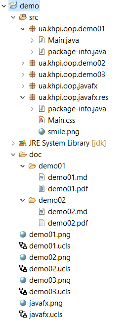
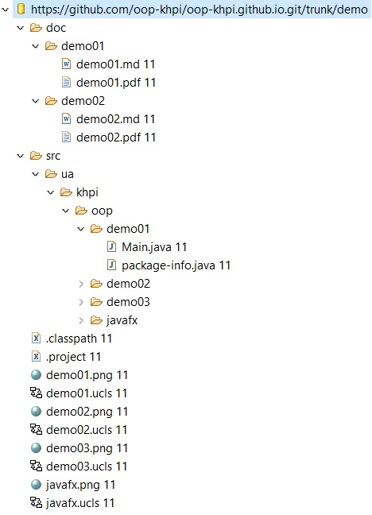

# Об'єктно-орієнтоване програмування

## Мета

- **Оволодіти** основами мови програмування [Java](https://ru.wikipedia.org/wiki/Java).
- **Отримати** навички розробки програм з використанням принципів [ООП](https://ru.wikipedia.org/wiki/%D0%9E%D0%B1%D1%8A%D0%B5%D0%BA%D1%82%D0%BD%D0%BE-%D0%BE%D1%80%D0%B8%D0%B5%D0%BD%D1%82%D0%B8%D1%80%D0%BE%D0%B2%D0%B0%D0%BD%D0%BD%D0%BE%D0%B5_%D0%BF%D1%80%D0%BE%D0%B3%D1%80%D0%B0%D0%BC%D0%BC%D0%B8%D1%80%D0%BE%D0%B2%D0%B0%D0%BD%D0%B8%D0%B5).
- **Ознайомитись** з платформою [Java SE](https://en.wikipedia.org/wiki/Java_Platform,_Standard_Edition).

---

## Зміст

[Програмні засоби та інструменти](#soft) 
[Рекомендації](#references) 
[Спільні завдання](#lab_todo) 
[Вимоги](#lab_requirements) 
&nbsp;&nbsp;&nbsp;&nbsp;&nbsp;&nbsp;[Структура проекту](#lab_project) 
&nbsp;&nbsp;&nbsp;&nbsp;&nbsp;&nbsp;[Робота з репозиторієм](#lab_repo) 
&nbsp;&nbsp;&nbsp;&nbsp;&nbsp;&nbsp;[Звіт](#lab_report) 
[Лабораторні роботи](#lab_tasks) 
&nbsp;&nbsp;&nbsp;&nbsp;&nbsp;&nbsp;[1. Структура програми мовою Java. Типи даних, літерали, операції і оператори](#task_01) 
&nbsp;&nbsp;&nbsp;&nbsp;&nbsp;&nbsp;[2. Алгоритмічна декомпозиція. Прості алгоритми обробки даних](#task_02) 
&nbsp;&nbsp;&nbsp;&nbsp;&nbsp;&nbsp;[3. Утилітарні класи. Обробка масивів і рядків](#task_03) 
&nbsp;&nbsp;&nbsp;&nbsp;&nbsp;&nbsp;[4. Інтерактивні консольні програми для платформи Java SE](#task_04) 
&nbsp;&nbsp;&nbsp;&nbsp;&nbsp;&nbsp;[5. Розробка власних контейнерів. Ітератори](#task_05) 
&nbsp;&nbsp;&nbsp;&nbsp;&nbsp;&nbsp;[6. Серіалізація/десеріалізація об'єктів. Бібліотека класів користувача](#task_06) 
&nbsp;&nbsp;&nbsp;&nbsp;&nbsp;&nbsp;[7. Об'єктно-орієнтована декомпозиція](#task_07) 
&nbsp;&nbsp;&nbsp;&nbsp;&nbsp;&nbsp;[8. Основи введення/виведення Java SE](#task_08) 
&nbsp;&nbsp;&nbsp;&nbsp;&nbsp;&nbsp;[9. Параметризація в Java](#task_09) 
&nbsp;&nbsp;&nbsp;&nbsp;&nbsp;&nbsp;[10. Обробка параметризованих контейнерів](#task_10) 

[Розрахункове завдання](#summary_task) 
[Завдання для студентів заочної форми навчання](#external_task) 
[Додатки](#appendixes) 
&nbsp;&nbsp;&nbsp;&nbsp;&nbsp;&nbsp;[Приклади](#examples) 
&nbsp;&nbsp;&nbsp;&nbsp;&nbsp;&nbsp;[Документи](#documents) 
[Примітки](#notes) 
[Література](#literature) 

---

## Програмні засоби та інструменти

1. [Java SE Development Kit 8](http://www.oracle.com/technetwork/java/javase/downloads/jdk8-downloads-2133151.html) - комплект розробника застосунків на мові Java (див. файл [se_appendix_1.pdf](https://github.com/oop-khpi/oop-khpi.github.io/raw/master/doc/oop_appendix_1.pdf)).

2. [Eclipse IDE for Java Developers](http://www.eclipse.org/downloads/eclipse-packages/) - середовище розробки. Додатково встановити:
	- [ObjectAid UML Explorer update site URL](http://www.objectaid.com/update/current/). Встановити тільки [ObjectAid Class Diagram plug-in](http://www.objectaid.com/class-diagram) - плагін візуалізації кода (показує UML class diagram);
	- [Checkstyle update site URL](http://eclipse-cs.sourceforge.net/update) - перевіряє початковий код на відповідність стандартам кодування. Використовувати конфігурацію [Sun Checks Eclipse](http://www.vogella.com/tutorials/Checkstyle/article.html#installation) ([інсталяція](http://eclipse-cs.sourceforge.net/#!/install), [налаштування](http://eclipse-cs.sourceforge.net/#!/project-setup), [Tutorial](http://www.vogella.com/tutorials/Checkstyle/article.html));
	- [Regex Util update site URL](http://regex-util.sourceforge.net/update/) - для зручної перевірки [регулярних виразів](https://ru.wikipedia.org/wiki/%D0%A0%D0%B5%D0%B3%D1%83%D0%BB%D1%8F%D1%80%D0%BD%D1%8B%D0%B5_%D0%B2%D1%8B%D1%80%D0%B0%D0%B6%D0%B5%D0%BD%D0%B8%D1%8F) ([Project home](http://myregexp.com/eclipsePlugin.html)). Відкрити в Eclipse за допомогою меню `Window / Show View / Other / Regex Util`.
	- [Subclipse Eclipse update site URL](https://dl.bintray.com/subclipse/releases/subclipse/latest/) <abbr title="SVN-репозиторій використовувати за розсудом викладача">[1](#note_svn)</abbr> - Eclipse plug-in which provides support for Subversion ([Project wiki](https://github.com/subclipse/subclipse/wiki)). Встановити компоненти:

		- Subclipse;
		- Subversion JavaHL Windows Native DLL's.

3. [TortoiseSVN](http://tortoisesvn.net/downloads.html) <abbr title="SVN-репозиторій використовувати за розсудом викладача">[1](#note_svn)</abbr> - Subversion (SVN) client. В лабораторіях ОЦ НТУ "ХПІ" включити використання *proxy-сервера* в меню *TortoiseSVN/Settings/Network*:
	- Enable Proxy Server;
	- Server address: 172.17.10.2;
	- Port: 3128.

4. [SVN Hosting](https://github.com) <abbr title="Використовувати за розсудом викладача">[1](#note_svn)</abbr> - веб-сервіс управління версіями:
	- потрібна попередня [реєстрація](https://github.com/join);
	- при реєстрації **обов'язково** вказувати **Username** у вигляді **surname-name** - прізвище та ім'я розробника [латинкою в нижньому регістрі](http://translit.kh.ua/?lat&passport).

---

## Рекомендації

- **Використовувати:**
	- [Java Code Conventions](http://www.oracle.com/technetwork/java/codeconventions-150003.pdf), ~128 KB;
	- [Java Language Specification](http://docs.oracle.com/javase/specs/jls/se8/jls8.pdf), ~3.75 MB;
	- [Java SE Development Kit 8 Documentation](http://www.oracle.com/technetwork/java/javase/documentation/jdk8-doc-downloads-2133158.html), ~86 MB;
	- [Java SE Tutorial](http://www.oracle.com/technetwork/java/javase/java-tutorial-downloads-2005894.html), ~133 MB.
	- [Java SE Client Technologies: JavaFX](http://docs.oracle.com/javase/8/javase-clienttechnologies.htm), online + PDFs.

- **Ознайомитись:**
	- [Tutorial - Introduction to Java programming](http://www.vogella.com/tutorials/JavaIntroduction/article.html);
	- [Tutorial - Eclipse IDE](http://www.vogella.com/tutorials/Eclipse/article.html);
	- [Tutorial - Eclipse Shortcuts](http://www.vogella.com/tutorials/EclipseShortcuts/article.html);
	- [Tutorial - Java Debugging with Eclipse](http://www.vogella.com/tutorials/EclipseDebugging/article.html)
	- [Tutorial - Using the Checkstyle Eclipse plug-in](http://www.vogella.com/tutorials/Checkstyle/article.html);
	- [Java Platform Standard Edition 8 Documentation](http://docs.oracle.com/javase/8/docs/);
	- [Java Tutorials](http://docs.oracle.com/javase/tutorial/index.html);
	- [How to Write Doc Comments](http://www.oracle.com/technetwork/java/javase/documentation/index-137868.html);
	- [Google Java Style](http://google-styleguide.googlecode.com/svn/trunk/javaguide.html);
	- [Навігація і редагування в Eclipse](http://habrahabr.ru/post/168223/);
	- [Словник термінів ООП](http://vmk.ugatu.ac.ru/book/buch/glossary.htm).

---

## Спільні завдання

|  №  | Завдання |
| --- | :------- |
|  1  | Розробити програму для рішення [індивідуального завдання](#lab_tasks) |
|  2  | Виконати рефакторинґ з урахуванням загальних [вимог](#lab_requirements) |
|  3  | Підготувати до перевірки опис розробленої програми у вигляді [звіту](#lab_report) |
|  4  | Виправити програму з урахуванням отриманих зауважень |

---

## Вимоги

### Структура проекту

1. **Рішення** всіх лабораторних робіт розміщувати у відповідних пакетах єдиного проекту Eclipse (див. [приклад](#examples)):
	- **проект** повинен мати назву `surname-name` - прізвище та им'я розробника [латинкою в нижньому регістрі](http://translit.kh.ua/?lat&passport);
	- **пакети**, що містять всі розроблені класи та підпакети для кожного рішення, повинні мати назву `ua.khpi.oop.surnameXX`, де *XX* - номер роботи.

2. **Початковий** код повинен відповідати [Java Code Conventions](https://github.com/oop-khpi/oop-khpi.github.io/raw/master/doc/Java_Code_Conventions.pdf).

3. **Коментарі** використовувати для автоматичної генерації документації за допомогою [Javadoc](http://www.oracle.com/technetwork/java/javase/documentation/index-137868.html), [вікі](https://uk.wikipedia.org/wiki/Javadoc).

### Робота з репозиторієм <abbr title="SVN-репозиторій використовувати за розсудом викладача">[1](#note_svn)</abbr>

1. **Початковий** код (лише той, що успішно компілюється) розташовувати в директоріях `surname-name/src` у відповідних пакетах, де *surname-name* - назва особистої директорії в спільному сховищі, що відповідає назві проекту Eclipse.

2. **Звіти** розташовувати в директоріях `surname-name/doc/surnameXX` у файлах з назвою `surnameXX` та відповідним розширенням, де *XX* - номер роботи.

3. **Повідомлення** до коміту - що саме ви зберігаєте - має бути зрозумілим. У заголовку повідомлення вказувати:
	- **номер** тікета (завдання) - номер у [таблиці](#lab_todo), що містить список спільних завдань та зауважень;
	- **тему/компонент** до якого належить коміт. Наприклад:

		`#1, #3 shevchenko01: завдання виконано, звіт підготовлений до перевірки`

		`#2 task01: отформатирован текст и добавлены комментарии`
		
		`#4 Locator: алгоритм пошуку оптимізовано`
		
		`#4 task02: удалены лишние файлы`
		
		`#4 raeth: fix regression after [a002b90]`

4. **Репозиторій** для спільної розробки, що створив викладач, в Eclipse у вікні *SVN Repositories* перспективи *SVN Repository Exploring* підключити командою *Add SVN Repository*, використовуючи *Checkout URL* спільного сховища.

5. **Проект** Eclipse командою контекстного меню *Team / Share Project with SVN Repository* додати до репозиторію:
	- в діалоговому вікні обрати *Use existing repository location*;
	- вказати **Checkout URL спільного сховища**.

6. **Checkout URL спільного сховища** можна знайти під кнопкою *Clone or download* на відповідній сторінці [github.com](https://github.com) створеного викладачем проекту та додавши `/trunk`. *Checkout URL* для доступу до особистої директорії формується додаванням `/trunk` та назви особистої директорії. Наприклад:
	- після натискання кнопки *Clone or download* відображається:

		`https://github.com/oop-khpi/kitXX.git`

	- **Checkout URL спільного сховища** має вигляд:

		`https://github.com/oop-khpi/kitXX.git/trunk`

	- *Checkout URL* для доступу до особистої директорії *shevchenko-taras*:

		`https://github.com/cpp-khpi/kitXX.git/trunk/shevchenko-taras`

### Звіт

1. **Оформляється** українською мовою та надається у вигляді електронних документів:
	- що редагується *(docx/doc/odt/html/md/txt)*;
	- що зручно проглядається *(pdf/djvu/chm)*.

2. **Документ**, що друкується:
	- формат: **A4**; орієнтація: **книжкова**; поля: **2.5 см** ліворуч, **2 см** праворуч, **2 см** вгорі, **2 см** знизу;
	- шрифт: **Liberation Serif**, **Times New Roman** чи подібний; розмір: **14 pt**; міжрядковий інтервал: **одинарний**;
	- відступ першого рядка абзацу: **1.25 см**; вирівнювання: **у ширину**.

3. **Структура**:

| Обов'язковий розділ | Зауваження |
|:--------------------|:-----------|
| **Номер і тема роботи** | Вказується з вирівнюванням по центру рядка. |
| **Мета: ...** | Відповідає темі та завданню. |
| **1 ВИМОГИ** | Повне формулювання завдання. |
| **1.1 Розробник** | Інформація про розробника:  - прізвище, ім'я, по батькові;  - назва академічної групи;  - номер варіанту. |
| **1.2 Загальне завдання** | Вимоги, обмеження та зауваження. |
| **1.3 Задача** | Прикладна задача відповідно до варіанта. |
| **2 ОПИС ПРОГРАМИ** | Особливості рішення, структура програми, схеми та ілюстрації. |
| **2.1 Засоби ООП** | Обґрунтування застосовуваних об'єктно-орієнтованих методів. |
| **2.2 Ієрархія та структура класів** | Опис розроблених класів. |
| **2.3 Важливі фрагменти програми** | Частини тексту програми, що демонструють рішення задачі. |
| **3 ВАРІАНТИ ВИКОРИСТАННЯ** | Опис поведінки програми: "хто" і "що" може зробити.  Відповідає [функціональним вимогам](https://uk.wikipedia.org/wiki/%D0%A4%D1%83%D0%BD%D0%BA%D1%86%D1%96%D0%BE%D0%BD%D0%B0%D0%BB%D1%8C%D0%BD%D1%96_%D0%B2%D0%B8%D0%BC%D0%BE%D0%B3%D0%B8).  Ілюструється за допомогою копій екрану з описом. |
| **ВИСНОВКИ** | Заключення стосовно повноти досягнення мети. |

---

# Лабораторні роботи

## 1. Структура програми мовою Java. Типи даних, літерали, операції і оператори

### Мета

Ознайомлення з *JDK* платформи *Java SE* та середовищем розробки *Eclipse IDE*.

### Вимоги

1. Вирішити три прикладні задачі на мові *Java* в середовищі *Eclipse*.

2. Продемонструвати покрокове виконання програми та результати роботи в режимі налагодження, не використовуючи виведення до консолі.

3. Виконати компіляцію і запуск програми в [командному рядку](https://uk.wikipedia.org/wiki/%D0%86%D0%BD%D1%82%D0%B5%D1%80%D1%84%D0%B5%D0%B9%D1%81_%D0%BA%D0%BE%D0%BC%D0%B0%D0%BD%D0%B4%D0%BD%D0%BE%D0%B3%D0%BE_%D1%80%D1%8F%D0%B4%D0%BA%D0%B0) за допомогою відповідних утиліт *JDK*.

### Прикладні задачі

1. Обрати тип змінних та встановити за допомогою констант та літералів початкові значення:
	- число, що відповідає номеру залікової книжки за допомогою шістнадцяткового літералу;
	- число, що відповідає номеру мобільного телефона (починаючи з 380...) за допомогою десяткового літералу;
	- число, яке складається з останніх двох ненульових цифр номера мобільного телефону за допомогою двійкового літералу;
	- число, яке складається з останніх чотирьох ненульових цифр номера мобільного телефону за допомогою вісімкового літералу;
	- визначити збільшене на одиницю значення залишку від ділення на 26 зменшеного на одиницю номера студента в журналі групи;
	- символ англійського алфавіту в верхньому регістрі, номер якого відповідає знайденому раніше значенню.

2. Використовуючи десятковий запис цілочисельного значення кожної змінної знайти і підрахувати кількість парних і непарних цифр.

3. Використовуючи двійковий запис цілочисельного значення кожної змінної підрахувати кількість одиниць.

---

## 2. Алгоритмічна декомпозиція. Прості алгоритми обробки даних

### Мета

Розробка простих консольних програм для платформи *Java SE*.

### Вимоги

1. Розробити та продемонструвати програму мовою *Java* в середовищі *Eclipse* для вирішення прикладної задачі за номером, що відповідає збільшеному на одиницю залишку від ділення на 10 зменшеного на одиницю номера студента в журналі групи.

2. Для визначення вхідних даних використовувати генератор псевдовипадкових чисел *(java.util.Random)* та забезпечити циклічне (принаймні десять ітерацій) знаходження результату рішення прикладної задачі.

3. Забезпечити виведення до консолі відповідних значень вхідних даних та результатів обчислень у вигляді таблиці.

4. Застосувати функціональну (процедурну) [декомпозицію](https://ru.wikipedia.org/wiki/%D0%94%D0%B5%D0%BA%D0%BE%D0%BC%D0%BF%D0%BE%D0%B7%D0%B8%D1%86%D0%B8%D1%8F) і забезпечити рішення прикладної задачі за допомогою відповідних методів.

5. Забороняється використання даних типу [String](https://docs.oracle.com/javase/7/docs/api/java/lang/String.html) та [масивів](https://docs.oracle.com/javase/specs/jls/se7/html/jls-10.html) при знаходженні рішення прикладної задачі.

### Прикладні задачі

1. Знайти найбільший спільний дільник двох цілих позитивних чисел.

2. Знайти суму цифр заданого цілого числа.

3. Знайти найбільшу цифру в десятковому запису цілочисельного значення.

4. Знайти позиції всіх найменших цифр в десятковому запису цілочисельного значення.

5. Перевірити, чи є задане число простим (тобто не ділиться без залишку на жодні числа, крім себе і 1).

6. Перевірити чи дорівнює сума перших трьох цифр сумі останніх трьох цифр в десятковому запису 6-значного цілого числа.

7. Перевірити чи рівні значення першої та останньої, а також другої та передостанньої цифри в вісімковому запису 4-значного цілого числа.

8. Знайти суму всіх парних і суму всіх непарних цифр в десятковому запису 8-значного цілого числа.

9. Підрахувати кількість цифр, що відображаються за допомогою латинських букв в шістнадцятковому запису 10-значного цілого числа.

10. Знайти кількість комбінацій 01 та 10 в двійковому запису цілого числа.

---

## 3. Утилітарні класи. Обробка масивів і рядків

### Мета

- Розробка власних утилітарних класів.
- Набуття навичок вирішення прикладних задач з використанням масивів і рядків.

### Вимоги

1. Розробити та продемонструвати консольну програму мовою *Java* в середовищі *Eclipse* для вирішення прикладної задачі за номером, що відповідає збільшеному на одиницю залишку від ділення на 15 зменшеного на одиницю номера студента в журналі групи.

2. При вирішенні прикладних задач використовувати [латинку](https://uk.wikipedia.org/wiki/%D0%9B%D0%B0%D1%82%D0%B8%D0%BD%D1%81%D1%8C%D0%BA%D0%B0_%D0%B0%D0%B1%D0%B5%D1%82%D0%BA%D0%B0).

3. Продемонструвати використання об'єктів класу [StringBuilder](http://docs.oracle.com/javase/8/docs/api/java/lang/StringBuilder.html) або [StringBuffer](http://docs.oracle.com/javase/8/docs/api/java/lang/StringBuffer.html).

4. Застосувати функціональну (процедурну) декомпозицію - розробити власні утилітарні класи (особливий випадок допоміжного класу, див. [Helper Class](https://en.wikipedia.org/wiki/Helper_class)) та для обробки даних використовувати відповідні [статичні](https://docs.oracle.com/javase/tutorial/java/javaOO/classvars.html) методи.

5. Забороняється використовувати засоби обробки регулярних виразів: класи пакету [java.util.regex](https://docs.oracle.com/javase/7/docs/api/java/util/regex/package-summary.html) ([Pattern](https://docs.oracle.com/javase/7/docs/api/java/util/regex/Pattern.html), [Matcher](https://docs.oracle.com/javase/7/docs/api/java/util/regex/Matcher.html) та ін.), а також відповідні методи класу [String](https://docs.oracle.com/javase/7/docs/api/java/lang/String.html) ([matches](https://docs.oracle.com/javase/7/docs/api/java/lang/String.html#matches(java.lang.String)), [replace](https://docs.oracle.com/javase/7/docs/api/java/lang/String.html#replace(java.lang.CharSequence,%20java.lang.CharSequence)), [replaceFirst](https://docs.oracle.com/javase/7/docs/api/java/lang/String.html#replaceFirst(java.lang.String,%20java.lang.String)), [replaceAll](https://docs.oracle.com/javase/7/docs/api/java/lang/String.html#replaceAll(java.lang.String,%20java.lang.String)), [split](https://docs.oracle.com/javase/7/docs/api/java/lang/String.html#split(java.lang.String,%20int))).

### Рекомендації

1. [Java Language Specification. Arrays](https://docs.oracle.com/javase/specs/jls/se7/html/jls-10.html).
2. [Java Tutorials. Arrays](https://docs.oracle.com/javase/tutorial/java/nutsandbolts/arrays.html).
3. [Java SE API Specification. Class String](http://docs.oracle.com/javase/8/docs/api/java/lang/String.html).
4. [Java Tutorials. Manipulating Characters in a String](https://docs.oracle.com/javase/tutorial/java/data/manipstrings.html).
5. [Java Tutorials. Comparing Strings and Portions of Strings](https://docs.oracle.com/javase/tutorial/java/data/comparestrings.html)).

### Прикладні задачі

1. Ввести декілька рядків. Розбити рядки на три групи: починається з голосної; починається з приголосної; починається не з букви. Знайти найкоротший рядок в кожній групі. Вивести цей рядок та йогої довжину.

2. Ввести декілька рядків. Упорядкувати, а потім вивести рядки за алфавітом (перший пріоритет) та в порядку зростання їх довжини (другий пріоритет).

3. Ввести декілька рядків. Розбити на дві групи: рядки, довжина яких менша за середню; рядки, довжина яких не менше середньої. Вивести рядки та їх довжину по групах.

4. Ввести текст. У кожному слові тексту k-ту літеру замінити заданим символом. Якщо k більше довжини слова, видати повідомлення та заміну не виконувати. Початкові дані та результат вивести у вигляді таблиці.

5. Ввести текст. У тексті кожну літеру замінити її номером в алфавіті. Вивести результат наступним чином: в одному рядку друкувати текст з двома пропусками між буквами, в наступному рядку під кожною буквою друкувати її номер.

6. Ввести текст. З тексту видалити всі символи, крім пропусків, які не є буквами. Пропуски, що повторюються, замінити на одиночні. Між послідовностями літер, де знаходяться розділові знаки, залишити хоча б один пропуск ("a,b,c" -> "a, b, c"). Вивести початковий текст та результат.

7. Ввести текст. З тексту видалити всі слова заданої довжини, що починаються на приголосну літеру. Вивести початковий текст та результат.

8. Ввести текст. У тексті знайти всі пари слів, з яких одне є обігом (словом навпаки) іншого (наприклад: "abc"-"cba", "def"-"fed"). Результат вивести у вигляді таблиці.

9. Ввести текст. Знайти та вивести, скільки разів повторюється в тексті кожне слово. Результат вивести у вигляді таблиці.

10. Ввести текст. Визначити та вивести, яких літер (голосних чи приголосних) більше в кожному реченні тексту. Результат вивести у вигляді таблиці.

11. Ввести текст. У тексті слова заданої довжини замінити зазначеним рядком. Вивести початковий текст та результат.

12. Ввести текст. Текст розбити на речення. Для кожного речення вивести слова, у яких перша та остання літери співпадають. Результат вивести у вигляді таблиці.

13. Ввести текст. Текст розбити на речення. Для кожного речення знайти та надрукувати всі слова максимальної та всі слова мінімальної довжини. Результат вивести у вигляді таблиці.

14. Ввести текст. Після кожного слова тексту, що закінчується заданим символом, вставити зазначений рядок. Вивести початковий текст та результат.

15. Ввести текст. У тексті знайти та вивести всі слова-паліндроми (однаково читається в обох напрямках - зліва направо та справа наліво. Наприклад: "noon", "civic", "radar", "level", "rotor", "refer").

---

## 4. Інтерактивні консольні програми для платформи Java SE

### Мета

Реалізація діалогового режиму роботи з користувачем в консольних програмах мовою Java.

### Вимоги

1. Використовуючи програму рішення завдання [лабораторної роботи №3](#task_03), відповідно до [прикладної задачі](#task_03_app) забезпечити обробку команд користувача у вигляді текстового [меню](https://ru.wikipedia.org/wiki/%D0%9C%D0%B5%D0%BD%D1%8E_(%D0%B8%D0%BD%D1%84%D0%BE%D1%80%D0%BC%D0%B0%D1%82%D0%B8%D0%BA%D0%B0)#.D0.9C.D0.B5.D0.BD.D1.8E_.D0.B2_.D0.B8.D0.BD.D1.82.D0.B5.D1.80.D1.84.D0.B5.D0.B9.D1.81.D0.B5_.D0.BA.D0.BE.D0.BC.D0.B0.D0.BD.D0.B4.D0.BD.D0.BE.D0.B9_.D1.81.D1.82.D1.80.D0.BE.D0.BA.D0.B8):
	- введення даних;
	- перегляд даних;
	- виконання обчислень;
	- відображення результату;
	- завершення програми і т.д.

2. Забезпечити обробку параметрів [командного рядка](https://uk.wikipedia.org/wiki/%D0%86%D0%BD%D1%82%D0%B5%D1%80%D1%84%D0%B5%D0%B9%D1%81_%D0%BA%D0%BE%D0%BC%D0%B0%D0%BD%D0%B4%D0%BD%D0%BE%D0%B3%D0%BE_%D1%80%D1%8F%D0%B4%D0%BA%D0%B0) для визначення режиму роботи програми:
	- параметр "-h" чи "-help": відображається інформація про автора програми, призначення (індивідуальне завдання), детальний опис режимів роботи (пунктів меню та параметрів командного рядка);
	- параметр "-d" чи "-debug": в процесі роботи програми відображаються додаткові дані, що полегшують налагодження та перевірку працездатності програми: діагностичні повідомлення, проміжні значення змінних, значення тимчасових змінних та ін.

---

## 5. Розробка власних контейнерів. Ітератори

### Мета

- Набуття навичок розробки власних контейнерів.
- Використання ітераторів.

### Вимоги

1. Розробити клас-контейнер, що [ітерується](http://docs.oracle.com/javase/8/docs/api/java/lang/Iterable.html) для збереження початкових даних завдання [л.р. №3](#task_03_app) у вигляді **масиву рядків** з можливістю додавання, видалення і зміни елементів.

2. В контейнері реалізувати та продемонструвати наступні методи:
	- `String toString()` повертає вміст контейнера у вигляді рядка;
	- `void add(String string)` додає вказаний елемент до кінця контейнеру;
	- `void clear()` видаляє всі елементи з контейнеру;
	- `boolean remove(String string)` видаляє перший випадок вказаного елемента з контейнера;
	- `Object[] toArray()` повертає масив, що містить всі елементи у контейнері;
	- `int size()` повертає кількість елементів у контейнері;
	- `boolean contains(String string)` повертає `true`, якщо контейнер містить вказаний елемент;
	- `boolean containsAll(Container container)` повертає `true`, якщо контейнер містить всі елементи з зазначеного у параметрах;
	- `public Iterator<String> iterator()` повертає ітератор відповідно до [Interface Iterable](http://docs.oracle.com/javase/8/docs/api/java/lang/Iterable.html).

3. В класі ітератора відповідно до [Interface Iterator](http://docs.oracle.com/javase/8/docs/api/java/util/Iterator.html) реалізувати методи:
	- `public boolean hasNext()`;
	- `public String next()`;
	- `public void remove()`.

4. Продемонструвати роботу ітератора за допомогою циклів *while* и *for each*.

5. Забороняється використання контейнерів (колекцій) і алгоритмів з [Java Collections Framework](https://docs.oracle.com/javase/8/docs/technotes/guides/collections/).

---

## 6. Серіалізація/десеріалізація об'єктів. Бібліотека класів користувача

### Мета

- Тривале зберігання та відновлення стану об'єктів.
- Ознайомлення з принципами серіалізації/десеріалізації об'єктів.
- Використання бібліотек класів користувача.

### Вимоги

1. Реалізувати і продемонструвати тривале зберігання/відновлення [раніше розробленого контейнера](#task_05) за допомогою [серіалізації/десеріалізації](https://docs.oracle.com/javase/8/docs/technotes/guides/serialization/index.html).

2. Обмінятися відкомпільованим (без початкового коду) службовим класом (Utility Class) рішення задачі [л.р. №3](#task_03_app) з іншим студентом (визначає викладач).

3. Продемонструвати послідовну та вибіркову обробку елементів розробленого контейнера за допомогою власного і отриманого за обміном службового класу.

4. Реалізувати та продемонструвати порівняння, сортування та пошук елементів у контейнері.

5. Розробити консольну програму та забезпечити діалоговий режим роботи з користувачем для демонстрації та тестування рішення.

### Рекомендації

1. [Java Object Serialization Specification](https://docs.oracle.com/javase/8/docs/platform/serialization/spec/serialTOC.html).
2. [Java object serialization. Tutorial](http://www.vogella.com/tutorials/JavaSerialization/article.html).
3. [Пять вещей, которые вы не знали о сериализации](http://www.ibm.com/developerworks/ru/library/j-5things1/).

---

## 7. Об'єктно-орієнтована декомпозиція

### Мета

Використання об'єктно-орієнтованого підходу для розробки об'єкта предметної (прикладної) галузі.

### Вимоги

1. Використовуючи об'єктно-орієнтований аналіз, реалізувати класи для представлення сутностей відповідно [прикладної задачі](#task_07_app) - domain-об'єктів.

2. Забезпечити та продемонструвати коректне введення та відображення кирилиці.

3. Продемонструвати можливість управління масивом domain-об'єктів.

### Рекомендації

1. [Wiki: Decomposition](https://en.wikipedia.org/wiki/Decomposition_(computer_science)).
2. [Wiki: Plain old Java object](https://en.wikipedia.org/wiki/Plain_old_Java_object).
3. [Wiki: JavaBeans](https://en.wikipedia.org/wiki/JavaBeans).
4. [Wiki: Доменный объект](https://ru.wikipedia.org/wiki/%D0%94%D0%BE%D0%BC%D0%B5%D0%BD%D0%BD%D1%8B%D0%B9_%D0%BE%D0%B1%D1%8A%D0%B5%D0%BA%D1%82).
5. [Wiki: Object-oriented analysis and design](https://en.wikipedia.org/wiki/Object-oriented_analysis_and_design).

### Прикладні задачі

1. Кадрове агентство. Дані про претендента: реєстраційний номер; досвід роботи - набір значень "спеціальність, стаж"; освіта; дата звільнення; вимоги до майбутньої роботи - набір необов'язкових властивостей у вигляді "спеціальність, умови праці, мінімальна зарплата".

2. Кадрове агентство. Дані про вакансії: фірма; спеціальність; умови праці; оплата; вимоги до фахівця - набір необов'язкових властивостей у вигляді "спеціальність, стаж, освіта".

3. Адресна книга. Запис: П.І.Б .; дата народження; телефони (кількість не обмежена); адреса; дата і час редагування.

4. Бібліотека. Дані про книгу: [ISBN](https://uk.wikipedia.org/wiki/ISBN); назва; автори (кількість не обмежена); видавництво; жанр; дата видання.

5. Довідник покупця. Торгівельна точка: назва; адреса; телефони (кількість не обмежена); спеціалізація; час роботи (з зазначенням днів тижня).

6. Поліцейська картотека. Дані про злочинця: П.І.Б.; дата народження; дати судимостей (кількість не обмежена); дата останнього позбавлення волі; дата останнього звільнення.

7. Бюро знайомств. Запис про клієнта: стать; реєстраційний номер; дата реєстрації; відомості про себе (довільний набір властивостей: ім'я, зріст, колір очей, дата народження, хобі тощо); вимоги до партнера (довільний набір властивостей).

8. Автостанція. Запис в розкладі: номер рейсу; час відправлення; дні тижня; кількість вільних місць; маршрут - необмежений набір значень у вигляді "назва станції, час прибуття".

9. Квиткова каса. Дані про маршрут: маршрут - необмежений набір значень у вигляді "назва станції, час прибуття (для проміжних і кінцевої), час відправлення (для початкової та проміжних), кількість вільних місць"; загальна кількість місць; дні тижня; номер рейсу.

10. Відділ кадрів. Особиста картка співробітника: паспортні дані; освіта; оклад; кар'єра - набір значень "дата призначення, посада, відділ"; характеристика - набір властивостей і оцінок.

11. Магазин. Запис в каталозі товарів: найменування; одиниця виміру; кількість; ціна одиниці; дата надходження; опис (необмежений набір характеристик у вигляді "властивість, значення").

12. Аудіотека. Композиція: назва; жанр; виконавець; текст (якщо є); дата створення; тривалість; формат даних; рейтинг (набір характеристик вигляду "властивість, значення").

13. Готель. Замовлення номера: паспортні дані; дати поселення та виселення; номер (клас, число місць); причина поселення (кількість не обмежена).

14. Планувальник. Захід: дата, час початку і тривалість; місце проведення; опис; учасники (кількість не обмежена).

15. Автосалон. Автомобіль: марка, рік випуску, технічні характеристики у вигляді "параметр - значення" (серед яких витрата палива в міському і заміському циклі), технічний стан, ціна.

16. Поліцейська картотека. Дані про в'язня: П.І.Б.; дата народження; зріст; колір очей; особливі прикмети (кількість не обмежена); дата ув'язнення; дата звільнення.

---

## 8. Основи введення/виведення Java SE

### Мета

Оволодіння навичками управління введенням/виведенням даних з використанням класів платформи Java SE.

### Вимоги

1. Забезпечити можливість збереження і відновлення масива об'єктів рішення завдання [лабораторної роботи №7](#task_07).

2. Забороняється використання [стандартного протокола серіалізації](https://docs.oracle.com/javase/8/docs/platform/serialization/spec/serialTOC.html).

3. Продемонструвати використання моделі [Long Term Persistence](https://docs.oracle.com/javase/tutorial/javabeans/advanced/longpersistence.html).

4. Забезпечити діалог з користувачем у вигляді простого текстового меню.

5. При збереженні та відновленні даних забезпечити діалоговий режим вибору директорії з відображенням вмісту і можливістю переміщення по підкаталогах.

### Рекомендації

1. [Java Tutorials: Basic I/O](https://docs.oracle.com/javase/tutorial/essential/io/index.html).
2. [Java SE API Specification: Package java.io](https://docs.oracle.com/javase/9/docs/api/java/io/package-summary.html).
3. [Java IO Tutorial](http://tutorials.jenkov.com/java-io/index.html).
4. [Java SE API Specification: Package java.beans](https://docs.oracle.com/javase/9/docs/api/java/beans/package-summary.html).
5. [Java Tutorials: JavaBeans Long Term Persistence](https://docs.oracle.com/javase/tutorial/javabeans/advanced/longpersistence.html).

---

## 9. Параметризація в Java

### Мета

1. Вивчення принципів параметризації в Java.

2. Розробка параметризованих класів та методів.

### Вимоги

1. Створити власний клас-контейнер, що параметризується ([Generic Type](https://docs.oracle.com/javase/tutorial/java/generics/types.html)), на основі [зв'язних списків](https://en.wikipedia.org/wiki/Linked_list) для реалізації колекції domain-об’єктів [лабораторної роботи №7](#task_07).

2. Для розроблених класів-контейнерів забезпечити можливість використання їх об'єктів у циклі [foreach](https://docs.oracle.com/javase/8/docs/technotes/guides/language/foreach.html) в якості джерела даних.

3. Забезпечити можливість збереження та відновлення колекції об'єктів: 1) за допомогою стандартної серіалізації; 2) не використовуючи протокол серіалізації.

4. Продемонструвати розроблену функціональність: створення контейнера, додавання елементів, видалення елементів, очищення контейнера, перетворення у масив, перетворення у рядок, перевірку на наявність елементів.

5. Забороняється використання контейнерів (колекцій) з [Java Collections Framework](https://docs.oracle.com/javase/8/docs/technotes/guides/collections/).

---

## 10. Обробка параметризованих контейнерів

### Мета

Розширення функціональності параметризованих класів.

### Вимоги

Використовуючи програму рішення завдання [лабораторної роботи №9](#task_09):

1. Розробити параметризовані методи ([Generic Methods](https://docs.oracle.com/javase/tutorial/java/generics/methods.html)) для обробки колекцій об'єктів згідно [прикладної задачі](#task_10_app).

2. Продемонструвати розроблену функціональність (створення, управління та обробку власних контейнерів) в діалоговому та автоматичному режимах.

	- Автоматичний режим виконання програми задається параметром командного рядка **-auto**. Наприклад, `java ClassName -auto`.

	- В автоматичному режимі діалог з користувачем відсутній, необхідні данні генеруються, або зчитуються з файлу.

3. Забороняється використання алгоритмів з [Java Collections Framework](https://docs.oracle.com/javase/8/docs/technotes/guides/collections/).

### Прикладні задачі

1. [Кадрове агентство](#task_07_01). Сортування за реєстраційним номером, за сумарним стажем, за середнім значенням необхідної мінімальної зарплатні.

2. [Кадрове агентство](#task_07_02). Сортування за назвою фірми, за назвою запропонованої спеціальності, за вказаною освітою.

3. [Адресна книга](#task_07_03). Сортування за прізвищем, за ім'ям, за датою народження, за датою редагування.

4. [Бібліотека](#task_07_04). Сортування за назвою, за видавництвом, за жанром, за датою видання.

5. [Довідник покупця](#task_07_05). Сортування за назвою, за містом в адресі, за спеціалізацією.

6. [Поліцейська картотека](#task_07_06). Сортування за прізвищем, за датою народження, за датою останнього позбавлення волі, за датою останнього звільнення.

7. [Бюро знайомств](#task_07_07). Сортування за датою реєстрації, за кількістю властивостей в розділі "відомості про себе", за кількістю властивостей в розділі "вимоги до партнера".

8. [Автостанція](#task_07_08). Сортування за номером рейсу, за часом відправлення, за кількістю вільних місць.

9. [Квиткова каса](#task_07_09). Сортування за загальною кількістю місць, за днем тижня, за номером рейсу.

10. [Відділ кадрів](#task_07_10). Сортування за серією та номером паспорта, за окладом, за середньою оцінкою.

11. [Магазин](#task_07_11). Сортування за найменуванням товару, за ціною одиниці, за датою надходження.

12. [Аудіотека](#task_07_12). Сортування за назвою композиції, за виконавцем, за середнім значенням рейтингу.

13. [Готель](#task_07_13). Сортування за тривалістю проживання, за класом номера, за кількістю займаних місць.

14. [Планувальник](#task_07_14). Сортування за датою заходу, за тривалістю, за кількістю учасників.

15. [Автосалон](#task_07_15). Сортування за роком випуску авто, за витратою палива в змішаному циклі, за запитуваною ціною.

16. [Поліцейська картотека](#task_07_16). Сортування за прізвищем, за датою народження, за датою ув'язнення, за датою звільнення.

---

---

## Розрахункове завдання <abbr title="Уточнення завдання і засобів розробки за розсудом викладача">[2](#note_summary)</abbr>

### Тема

Розробка графічного інтерфейсу користувача.

### Мета

Придбання навичок використання засобів клієнтських технологій *(Client Technologies)* платформи *Java SE*.

### Завдання

Розробити графічний інтерфейс користувача для програми рішення [лабораторної роботи №8](#task_08) з використанням засобів платформи [JavaFX](http://docs.oracle.com/javase/8/javase-clienttechnologies.htm) ([Working with JavaFX UI Components](http://docs.oracle.com/javase/8/javafx/user-interface-tutorial/)).

### Звіт

Відповідає структурі [звітів з лабораторних робіт](#lab_report).

### Зауваження

За розсудом викладача дозволяється оформлення звіту в електронному вигляді з використанням засобів [Javadoc](http://www.oracle.com/technetwork/java/javase/documentation/javadoc-137458.html) або [Doxygen](http://www.stack.nl/~dimitri/doxygen/index.html) та [Markdown](https://ru.wikipedia.org/wiki/Markdown)-розмітки.

---

## Завдання для студентів заочної форми навчання <abbr title="Уточнення завдання і засобів розробки за розсудом викладача">[2](#note_summary)</abbr>

### Тема

Розробка об'єктно-орієнтованих програм мовою *Java* для вирішення прикладних задач.

### Мета

Придбання навичок застосування об'єктно-орієнтованої [декомпозиції](https://uk.wikipedia.org/wiki/%D0%94%D0%B5%D0%BA%D0%BE%D0%BC%D0%BF%D0%BE%D0%B7%D0%B8%D1%86%D1%96%D1%8F) при вирішенні прикладних задач мовою *Java*.

### Завдання

1. Розробити програму рішення [лабораторної роботи №8](#task_08).

2. Оформити звіт, що містить опис розробленої програми та результат її тестування.

3. Використовувати середовище розробки [Eclipse IDE](http://www.eclipse.org/downloads/).

### Звіт

Відповідає структурі [звітів з лабораторних робіт](#lab_report).

### Зауваження

За розсудом викладача дозволяється оформлення звіту в електронному вигляді з використанням засобів [Javadoc](http://www.oracle.com/technetwork/java/javase/documentation/javadoc-137458.html) або [Doxygen](http://www.stack.nl/~dimitri/doxygen/index.html) та [Markdown](https://ru.wikipedia.org/wiki/Markdown)-розмітки.

---

## Додатки

### Приклади

#### Структура проекту [demo](https://github.com/oop-khpi/oop-khpi.github.io/tree/master/demo)

| Проект *demo* | Репозиторій проекта *demo* |
| ------------- | -------------------------- |
|  |  |

#### Пакети проекту [demo](https://github.com/oop-khpi/oop-khpi.github.io/tree/master/demo)

|  №  | Пакет | Опис |
| --- | ----- | ---- |
|  1  | [ua.khpi.oop.demo01](https://github.com/oop-khpi/oop-khpi.github.io/tree/master/demo/src/ua/khpi/oop/demo01) | Демонстрація структури проекту рішення завдання лабораторної роботи №1 |
|  2  | [ua.khpi.oop.demo02](https://github.com/oop-khpi/oop-khpi.github.io/tree/master/demo/src/ua/khpi/oop/demo02) | Демонстрація структури проекту рішення завдання лабораторної роботи №2 |
|  3  | [ua.khpi.oop.demo03](https://github.com/oop-khpi/oop-khpi.github.io/tree/master/demo/src/ua/khpi/oop/demo03) | Демонстрація визначення часу обробки даних |
|  4  | [ua.khpi.oop.javafx](https://github.com/oop-khpi/oop-khpi.github.io/tree/master/demo/src/ua/khpi/oop/javafx) | Демонстрація простої віконної (JavaFX) програми |

### Документи

|  №  | Файл | Опис |
| --- | ---- | ---- |
|  1  | [Java_Code_Conventions.pdf](https://github.com/oop-khpi/oop-khpi.github.io/raw/master/doc/Java_Code_Conventions.pdf) | Java Code Conventions. Рекомендується до використання |
|  2  | [oop_appendix_1.pdf](https://github.com/oop-khpi/oop-khpi.github.io/raw/master/doc/oop_appendix_1.pdf) | Налаштування середовища розробки; основи роботи в середовищі Eclipse; стиль кодування |
|  3  | [demo01.pdf](https://github.com/oop-khpi/oop-khpi.github.io/raw/master/demo/doc/demo01/demo01.pdf) | Приклад звіту |

---

## Примітки

1. [SVN-репозиторій](https://uk.wikipedia.org/wiki/Subversion) використовувати за розсудом викладача.

2. Уточнення завдання і засобів розробки за розсудом викладача.

---

## Література

### Для новачків

1. Кен Арнольд, Джеймс Гослинг. Язык программирования Java  ISBN: [9780201634556](http://www.isbnsearch.org/isbn/9780201634556)  Написана просто, містить багато корисної інформації. Джеймс Гослінг - один з авторів Java. Рекомендується всім, хто починає знайомитися з мовою. Має сенс переглянути і більш досвідченим програмістам.

2. Хорстманн. Java 2. Том 1. Основы  ISBN: [9780132354769](http://www.isbnsearch.org/isbn/9785845919588)  Розглядаються різні аспекти мови - від використання assert до регулярних виразів і NIO.

3. Дэвид Флэнаган. Java в примерах. Справочник  ISBN: [9780596006204](http://www.isbnsearch.org/isbn/9780596006204), [9781449370824](http://www.isbnsearch.org/isbn/9781449370824)  Містить безліч закінчених реалізацій окремих фрагментів технологій - RMI-виклики, доступ до баз через JDBC і т.д. Приклади прості для розуміння, їх можна легко модифікувати.

### Для досвідчених

4. Хорстманн. Java 2. Том 2. Тонкости программирования  ISBN: [9780132354790](http://www.isbnsearch.org/isbn/9780132354790)  Розглядаються більш серйозні теми - багатопоточне програмування, локалізація програми, питання безпеки, робота з XML.

5. Брюс Эккель. Философия Java  ISBN: [9780131872486](http://www.isbnsearch.org/isbn/9785496011273)  Треба прочитати кожному розробнику. Про філософію мови, про її устрій, її підхід до опису світу і вирішення задач. Дуже глибока і корисна для розуміння, що таке Java. Новачкам буде марна.

6. Джошуа Блох. Java. Эффективное программирование  ISBN: [9780321356680](http://www.isbnsearch.org/isbn/9780321356680)  У книзі 57 (78 у другому виданні) слабко пов'язаних одне з одним невеликих статей, що ілюструють тонкощі Java. Написана практиком з чималим досвідом. Читати, маючи серйозний досвід розробок.

### Про розробку в цілому

7. Стивен Стелтинг, Олав Маассен. Применение шаблонов Java  ISBN: [9780130935380](http://www.isbnsearch.org/isbn/9780130935380)  Присвячена шаблонами проектування - прийомам організації програм, які на практиці довели свою ефективність. Корисна, при проектуванні архітектури програм.

8. Гамма, Хелм, Джонсон, Влиссидес. Приемы объектно-ориентированного проектирования. Патерны проектирования  ISBN: [9780201633610](http://www.isbnsearch.org/isbn/9780201633610), [9780201634983](http://www.isbnsearch.org/isbn/9780201634983)  Читати тільки в оригіналі! Перекладачі доклали всіх зусиль до того, щоб зіпсувати все до неможливості.

9. Эрик Аллен. Типичные ошибки проектирования  ISBN: [9781590590614](http://www.isbnsearch.org/isbn/9781590590614)  Про те, як не треба робити. У ній зібрані типові помилки розробників. Корисна для тих, хто має деякий досвід.

10. Брюс Тейт. Горький вкус Java  ISBN: [9781930110434](http://www.isbnsearch.org/isbn/9781930110434)  Зібрані помилки програмування з використанням J2EE - сервлетів, JSP, EJB і т.п.
